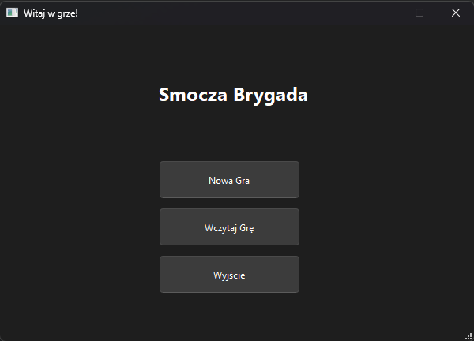
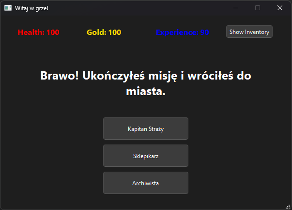

# Dragon Brigade – Open-Source RPG Framework

**Dragon Brigade** is an open-source, modular RPG framework developed entirely with the **free Qt framework**. This project provides a solid foundation for building a unique game where players take on the role of a firefighter battling dragons and other threats in a fantasy world.

## Key Features
- **Modular Mission System** – Each mission is independent, allowing easy expansion and story development.
- **Interactive Decision-Making** – Player choices influence the course of the missions.
- **Inventory and Economy System** – Players can collect items, purchase equipment, and manage resources.
- **Combat Mechanics** – Engage in battles against various enemies, including epic dragon encounters.
- **Central Hub** – A core area where players prepare for missions, manage inventory, and make story-driven decisions.

## Technology
- **Qt (C++)** – The free framework used to create the game's UI and mechanics.
- **Object-Oriented Gameplay Model** – The game is structured using class hierarchies, making it easy to extend.
- **Save and Load System** – Allows players to continue their progress at any time.

## Open Source
**Dragon Brigade** is an **entirely open-source project**, designed to be expanded by the community. Developers can modify the framework, add new missions, and adapt the game to their needs.

## Getting Started
1. Clone the repository containing the source code.
2. Set up your environment with **Qt Creator** or use **qmake** and **make** to compile the game.
3. Run the game and explore the world of **Dragon Brigade**.

##  Game Mechanics

### 1. **Mission System**
Missions are structured as **self-contained experiences**, each with a unique storyline and objectives. Players interact with NPCs, explore the environment, and engage in battles. 

The `Mission` class serves as the base for all missions, and new ones can be added by inheriting from it. Missions include:
- **Tutorial Mission** – Introduces basic mechanics and combat.
- **City Rescue Mission** – Navigate a burning city, save civilians, and fight a magma dragon.
- **Forest Fire Mission** – Extinguish a spreading fire while defending against fire-breathing creatures.
- **Volcano Mission** – Prevent an impending eruption while facing extreme conditions.

### 2. **Combat System**
The combat system is based on turn-based mechanics where:
- Players select weapons from their inventory.
- Each weapon has unique stats such as **firepower, level, and durability**.
- Enemies, like dragons, have **different attack patterns and resistances**.
- Players can strategize by selecting different approaches (e.g., aggressive offense or defensive tactics).

The `Fight` class manages these battles, ensuring that enemy health, player damage, and battle outcomes are processed dynamically.

### 3. **Inventory and Economy**
The inventory system allows players to manage and use various tools and items. Items include:
- **Firefighter Weapons** – Water bombs, water guns, and other tools specifically designed to fight dragons.
- **Defensive Gear** – Items like **lava-resistant boots** provide protection in dangerous environments.
- **Consumable Items** – Potions, energy packs, and special tools that grant temporary buffs.

The game includes an **in-game shop**, allowing players to:
- Purchase new weapons and equipment.
- Sell unused items.
- Upgrade tools to improve their effectiveness.

### 4. **Central Hub**
The **Hub** is the player's main base, where they can:
- Rest and recover after missions.
- Purchase or upgrade items in the shop.
- Interact with NPCs who provide lore, quests, and additional challenges.
- Choose the next mission, influencing the game's progression.

The `Hub` class facilitates all interactions within this safe zone, making it a crucial part of the game’s structure.

##  Expanding the Game
Developers can extend the game by:
- Adding **new missions** with unique challenges and branching choices.
- Creating **new weapons and equipment** to diversify player strategies.
- Expanding **enemy** to introduce more complex battles.
- Implementing **story-driven mechanics**, allowing the player’s actions to have long-term consequences.

## **Presentation**  

##  Contribute to the Project
If you have ideas for new mechanics or want to improve the game, feel free to **fork the repository** and submit your changes. 

Dragon Brigade is a **game made by developers, for developers** – fully open-source, freely available, and ready to be expanded into something truly unique.

## **Author**

Project created by Oskar Bełza. If you have any questions or suggestions, feel free to reach out!
